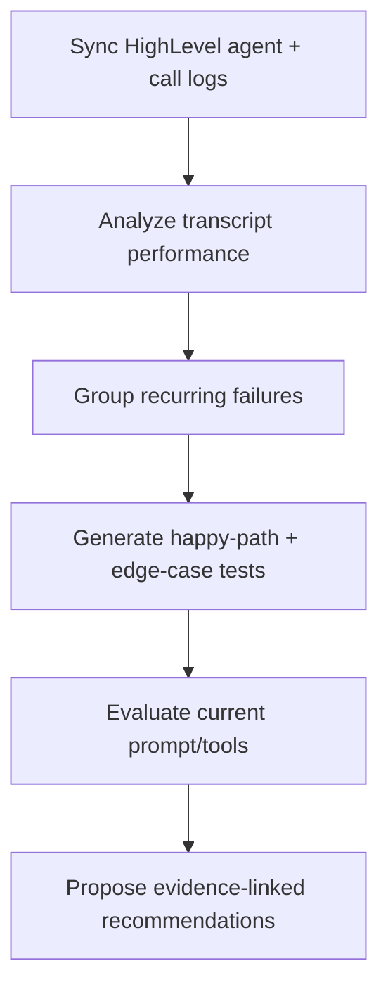
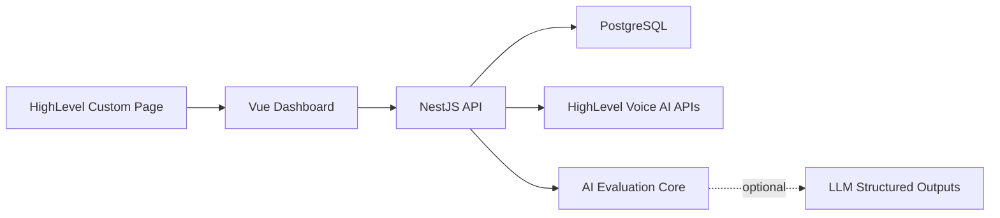

# Architecture Overview

Agent Optimizer is a modular monolith with a static embedded dashboard. The architecture is intentionally small enough for a team-of-one assignment while preserving the boundaries expected in a production integration: vendor adapters, typed contracts, durable persistence, pure AI logic, and review-gated recommendations.

## Product Loop

## System Boundaries

The dashboard delegates all sensitive work to the API. The backend owns HighLevel API calls, transcript persistence, analysis runs, generated tests, recommendation records, and correlation IDs.

## Backend Modules

| Module         | Responsibility                                                              |
| -------------- | --------------------------------------------------------------------------- |
| `config`       | Root `.env` loading and class-validator boot-time validation.               |
| `common`       | Cross-cutting middleware such as correlation IDs.                           |
| `health`       | API/database readiness endpoint.                                            |
| `highlevel`    | LeadConnector/HighLevel API client and vendor response parsing.             |
| `integrations` | Customer-facing HighLevel sync workflow.                                    |
| `analysis`     | Transcript analysis persistence and endpoints.                              |
| `optimization` | Generated tests, evaluations, recommendations, and optional LLM refinement. |
| `prisma`       | Prisma client lifecycle and shutdown hooks.                                 |

## Frontend Structure

`App.vue` is composition-only. Dashboard sections live in `apps/web/src/components`, and `apps/web/src/composables/useOptimizerDashboard.ts` owns API orchestration state.

This keeps the UI testable and avoids a single large component owning sync, analysis, and optimization concerns.

## Data Model

| Entity               | Purpose                                                             |
| -------------------- | ------------------------------------------------------------------- |
| `Tenant`             | HighLevel agency/company context.                                   |
| `Location`           | HighLevel sub-account context.                                      |
| `Agent`              | Voice AI agent prompt/config/action snapshot.                       |
| `Transcript`         | Imported call transcript payload and metadata.                      |
| `TranscriptAnalysis` | Outcome, score, criteria, and analysis timestamp.                   |
| `TranscriptFinding`  | Normalized failures or missed opportunities.                        |
| `GeneratedTestCase`  | Scenario, path type, success criteria, and source pattern.          |
| `TestCaseEvaluation` | Latest pass/fail/risk result for a generated test.                  |
| `Recommendation`     | Proposed optimization with before/after reasoning and evidence IDs. |

## HighLevel Integration

The HighLevel adapter uses the sandbox location private integration token to:

- Fetch the active location.
- Fetch Voice AI agents for that location.
- Store agent prompt/config/actions in PostgreSQL.
- List Voice AI call logs with `pageSize` pagination.
- Import transcript-like call payloads when HighLevel includes transcript/messages in call-log responses.

Fresh sandboxes can return no call logs. In that state, the optimizer still syncs live agent configuration and shows an empty-call-log readiness state.

## AI and Recommendation Design

The baseline engine is deterministic because reviewers can rerun it and inspect the exact logic. It performs:

- Transcript scoring against qualification, booking, tone, follow-up, objection, policy, and knowledge-gap criteria.
- Recurring pattern aggregation across transcripts.
- Test generation from the prompt plus observed failure patterns.
- Evaluation of generated tests against the current prompt/tool configuration.
- Recommendation generation with before/after reasoning and evidence IDs.

Optional LLM refinement is isolated in the API. It receives normalized findings, generated tests, evaluations, and baseline recommendations. It does not receive raw transcript turns.

## Governance

Recommendations remain consent-gated. Applying changes back to HighLevel through `PATCH /voice-ai/agents/:agentId` should be implemented as an explicit approval workflow, not as an automatic side effect of analysis.
