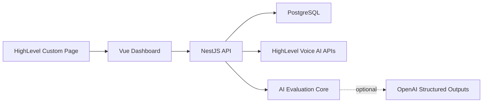

# Architecture Overview

## Product Loop

The optimizer closes three loops for a HighLevel Voice AI agent:

1. Analyze past call transcripts.
2. Generate realistic happy-path and edge-case tests.
3. Recommend prompt, model, temperature, tool, action, knowledge base, or guardrail changes.

Recommendations are proposed first. Applying changes to HighLevel is intentionally separated behind an approval step because prompt/config changes affect live customer conversations.

## System Boundaries

The dashboard runs as an embedded HighLevel surface and delegates all sensitive work to the API. The backend owns HighLevel API calls, transcript persistence, analysis runs, generated test cases, recommendation records, and audit-friendly correlation IDs.

## Code Organization

The API is a modular monolith. Nest feature modules live under `apps/api/src/modules` so each boundary owns its controller, service, DTOs, and provider wiring:

- `config`: root `.env` loading and class-validator boot-time validation.
- `health`: API and database readiness.
- `highlevel`: HighLevel client and vendor response parsing.
- `integrations`: customer-facing HighLevel sync workflow.
- `analysis`: transcript analysis persistence and API endpoints.
- `optimization`: generated tests, evaluations, and recommendations.
- `prisma`: Prisma client lifecycle.
- `common`: cross-cutting middleware.

The web app keeps `App.vue` as composition only. Dashboard sections live in `apps/web/src/components`, while `apps/web/src/composables/useOptimizerDashboard.ts` owns API orchestration state.

## HighLevel Integration

The HighLevel adapter uses the sandbox location private integration token to:

- Fetch the active location.
- Fetch Voice AI agents for that location.
- Store agent prompt/config/actions in PostgreSQL.
- List Voice AI call logs with `pageSize` pagination.
- Import transcript-like call payloads when HighLevel includes transcript/messages in call-log responses.

If a sandbox has no call logs yet, the optimizer still syncs live agent configuration and shows an empty-call-log onboarding state. This matches the sandbox constraint where paid telephony may be required for phone calls, while web calls can be used for short test calls.

## Transcript Analysis

Transcript analysis is split into a pure package and an API shell:

- `packages/ai` owns deterministic transcript scoring, missed-criteria detection, and recurring pattern aggregation.
- `packages/contracts` owns the structured `AnalysisBatch` response contract shared by API and web.
- `apps/api` loads stored agent config and transcripts, runs the analyzer, persists `TranscriptAnalysis`, replaces normalized `TranscriptFinding` records, and exposes the result.
- `apps/web` triggers analysis for a synced agent and displays average score, failure count, recurring patterns, and missed criteria per transcript.

The deterministic analyzer is intentional because it makes tests stable and keeps the contract explicit. An LLM judge can replace or augment the analyzer as long as it emits the same normalized contract.

## Optimization Loop

The optimization loop builds on persisted analysis results:

- `packages/ai` generates happy-path and edge-case test cases from the agent prompt plus recurring transcript patterns.
- The evaluator scores the current prompt/tool configuration against each generated test case's success criteria.
- The recommendation engine creates proposed prompt, temperature, model, tool/action, knowledge-base, or guardrail changes linked to transcript IDs and failed test criteria.
- If `OPENAI_API_KEY` is configured, the API asks OpenAI for structured recommendation refinement using normalized findings, generated tests, evaluations, and baseline recommendations. Raw transcript turns are not sent to that adapter.
- `apps/api` persists generated tests, latest evaluations, and recommendations behind deterministic external keys so reruns update the current proposal set.
- `apps/web` exposes `Run optimizer` for each synced agent and shows generated tests, pass/fail/risk evaluations, and before/after recommendation reasoning.

Recommendations remain consent-gated. The optimizer proposes changes only; applying a prompt/config change to HighLevel belongs behind the approval workflow.

## Data Model

The Prisma schema uses durable entities for the complete optimizer loop:

- `Tenant`: HighLevel agency/company context.
- `Location`: HighLevel sub-account context.
- `Agent`: Voice AI agent prompt/config snapshot.
- `Transcript`: call transcript payload and metadata.
- `TranscriptAnalysis`: persisted outcome, score, criteria, and analysis timestamp for one transcript.
- `TranscriptFinding`: normalized failures or missed opportunities.
- `GeneratedTestCase`: generated scenario, success criteria, path type, and source pattern.
- `TestCaseEvaluation`: latest pass/fail/risk result for a generated test.
- `Recommendation`: proposed optimization with before/after reasoning and evidence.

This keeps agent configuration, evidence, evaluation results, and recommendations independently queryable and auditable.
