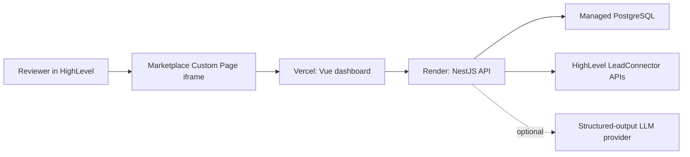

# Deployment Guide

This guide describes a practical production-style deployment for the assignment demo: PostgreSQL on Neon or Render, the NestJS API on Render, the Vue dashboard on Vercel, and a HighLevel Marketplace Custom Page that embeds the dashboard.

## Deployment Shape



The frontend is static and safe to deploy separately. The API owns every sensitive value: database URL, HighLevel private integration token, and optional LLM credentials.

## Production Environment Variables

Set these on the API host:

```bash
NODE_ENV=production
FRONTEND_ORIGIN=https://your-web-domain.vercel.app
DATABASE_URL=postgresql://...
GHL_LOCATION_ID=your_highlevel_location_id
GHL_LOCATION_PIT=pit-your-location-token
GHL_API_BASE_URL=https://services.leadconnectorhq.com
GHL_API_VERSION=2021-07-28
```

Optional LLM recommendation refinement:

```bash
LLM_API_KEY=provider-key
LLM_MODEL=provider-model
LLM_RESPONSES_URL=https://your-llm-provider.example/v1/responses
```

Set these on the web host:

```bash
VITE_API_BASE_URL=https://your-api-domain.onrender.com/api/v1
VITE_GHL_LOCATION_ID=your_highlevel_location_id
```

`FRONTEND_ORIGIN` must match the deployed browser origin exactly and must not include a trailing slash. `VITE_API_BASE_URL` must include `/api/v1`; the web client strips that suffix only for the neutral `/health` endpoint.

## Database

Use a managed PostgreSQL database. Neon and Render PostgreSQL both work for this app.

1. Create a PostgreSQL database.
2. Copy the pooled or direct connection string into `DATABASE_URL`.
3. Confirm the URL includes SSL settings if required by the provider.
4. Run migrations from the deployed API build or from a trusted local machine:

```bash
DATABASE_URL=postgresql://... pnpm --filter @agent-optimizer/api db:migrate:deploy
```

Prisma 7 reads `DATABASE_URL` through `apps/api/prisma.config.ts`; the schema file intentionally does not contain a datasource URL.

## API on Render

Create a Render Web Service from the GitHub repository.

Recommended settings:

| Setting           | Value                                                                                                                                |
| ----------------- | ------------------------------------------------------------------------------------------------------------------------------------ |
| Runtime           | Node                                                                                                                                 |
| Root directory    | repository root                                                                                                                      |
| Build command     | `corepack enable && corepack prepare pnpm@11.1.3 --activate && pnpm install --frozen-lockfile && pnpm db:generate && pnpm build:api` |
| Start command     | `pnpm deploy:api:start`                                                                                                              |
| Health check path | `/health`                                                                                                                            |

Render provides the public bind port through `PORT`; do not hardcode `API_PORT` on Render unless you intentionally need a local override.

Use the Neon direct connection string for `DATABASE_URL` during migrations. Avoid the `*-pooler.*.neon.tech` URL for `prisma migrate deploy`; pooled URLs are useful for application traffic but can fail or hang during schema migration.

Add the API environment variables from this guide. After deploy, verify:

```bash
curl https://your-api-domain.onrender.com/health
curl -i \
  -H "Origin: https://your-web-domain.vercel.app" \
  https://your-api-domain.onrender.com/health
```

The CORS response must include:

```text
access-control-allow-origin: https://your-web-domain.vercel.app
```

If the value has a trailing slash or points at the wrong Vercel project, browser requests will fail even when the API health endpoint is otherwise healthy.

## Web on Vercel

Create a Vercel project from the same repository.

Recommended settings:

| Setting          | Value                                                                                          |
| ---------------- | ---------------------------------------------------------------------------------------------- |
| Framework preset | Vite                                                                                           |
| Root directory   | repository root                                                                                |
| Install command  | `corepack enable && corepack prepare pnpm@11.1.3 --activate && pnpm install --frozen-lockfile` |
| Build command    | `pnpm build:web`                                                                               |
| Output directory | `apps/web/dist`                                                                                |

Add:

```bash
VITE_API_BASE_URL=https://your-api-domain.onrender.com/api/v1
VITE_GHL_LOCATION_ID=your_highlevel_location_id
```

After deploy, open the Vercel URL and confirm the API health panel resolves.

Because Vite inlines `VITE_*` values at build time, redeploy Vercel after changing `VITE_API_BASE_URL` or `VITE_GHL_LOCATION_ID`.

## HighLevel Custom Page

1. Open the HighLevel Marketplace developer dashboard.
2. Create or open the Agent Optimizer app.
3. Add a Custom Page for the sub-account distribution target.
4. Set the page URL to the deployed Vercel dashboard URL.
5. Install the app into the sandbox sub-account.
6. Open the Custom Page inside HighLevel.
7. Click `Sync HighLevel`, then run analysis and optimization.

The sandbox implementation uses `GHL_LOCATION_PIT`. A public Marketplace release should replace that with signed user context plus installed-account credentials.

## Documentation on GitHub Pages

The documentation site uses MkDocs Material

Local commands:

```bash
python3 -m venv .venv-docs
source .venv-docs/bin/activate
python -m pip install -r requirements.txt
mkdocs serve
mkdocs build --strict
```

GitHub Actions builds docs on pull requests and deploys to the `gh-pages` branch on pushes to `main` when `docs/**`, `mkdocs.yml`, or `requirements.txt` changes.

Repository setting:

1. Open GitHub repository settings.
2. Go to `Pages`.
3. Set source to `Deploy from a branch`.
4. Select branch `gh-pages` and folder `/root`.

Expected published URL:

```text
https://chitrank2050.github.io/agent-optimizer
```

## Deployment Verification

Run these after deployment:

```bash
curl https://your-api-domain.onrender.com/health
curl --request POST \
  --url https://your-api-domain.onrender.com/api/v1/integrations/highlevel/sync \
  --header 'content-type: application/json' \
  --data '{"locationId":"your_highlevel_location_id"}'
```

Then verify through the browser:

1. The dashboard loads from the deployed web URL.
2. API status shows healthy.
3. `Sync HighLevel` returns the sandbox agent.
4. `Run analysis` works when transcripts exist.
5. `Run optimizer` shows generated tests and proposed recommendations.

## Operational Notes

- Keep `GHL_LOCATION_PIT` and `LLM_API_KEY` only on the API host.
- Set `FRONTEND_ORIGIN` to the exact deployed web origin to keep CORS tight.
- Run database migrations before serving reviewer traffic.
- Do not enable automatic recommendation application without an approval workflow.
- If HighLevel call logs are empty, create web-call transcripts in the sandbox before recording the demo.
