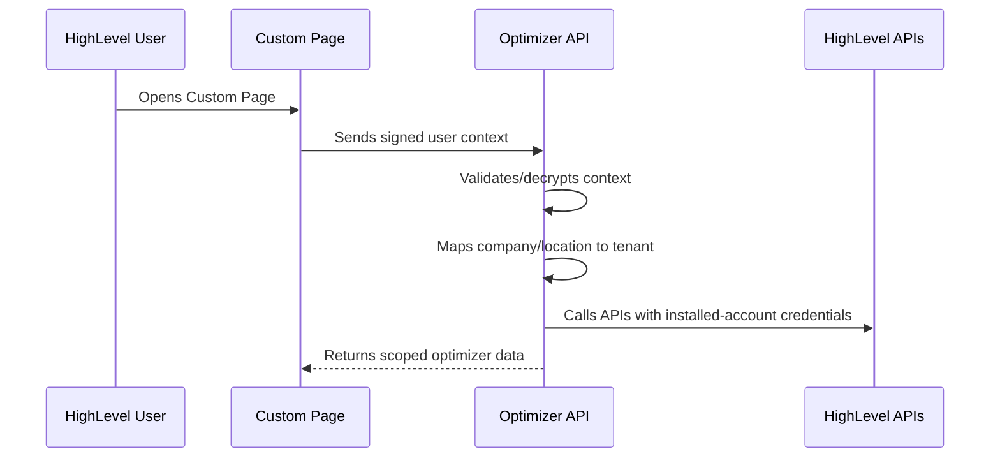

# HighLevel Sandbox Installation

The optimizer is designed to run inside HighLevel as a Marketplace Custom Page. In the sandbox, the page embeds the deployed or tunnelled Vue dashboard, and the dashboard calls the NestJS API for HighLevel sync, analysis, and recommendations.

## Requirements

- HighLevel sandbox agency account.
- Sub-account/location with Voice AI enabled.
- Location private integration token with location and Voice AI access.
- At least one Voice AI agent in the location.
- Web-call or phone-call logs with transcript-like payloads.

> [!NOTE]
> Paid telephony may require Stripe in the sandbox. The practical demo path is to use Voice AI web calls to create call logs without buying phone-call credits.

## Sandbox Environment

Set these values in the root `.env` file for local review:

```bash
GHL_LOCATION_ID=your_highlevel_location_id
GHL_LOCATION_PIT=pit-your-location-token
GHL_API_BASE_URL=https://services.leadconnectorhq.com
GHL_API_VERSION=2021-07-28
VITE_API_BASE_URL=http://localhost:3000/api/v1
VITE_GHL_LOCATION_ID=your_highlevel_location_id
```

For deployed review, replace `VITE_API_BASE_URL` with the deployed API URL. Keep `GHL_LOCATION_PIT` only on the API host.

## Custom Page Setup

1. Open the HighLevel Marketplace developer dashboard.
2. Create or open the Agent Optimizer marketplace app.
3. Add a Custom Page for the sub-account distribution target.
4. Set the page URL to the hosted Vue dashboard URL.
5. For local testing, expose `http://localhost:5173` through a secure HTTPS tunnel and use that tunnel URL.
6. Install the app into the sandbox sub-account.
7. Open the Custom Page inside HighLevel and verify the dashboard loads.

## Reviewer Flow

1. Click `Sync HighLevel`.
2. Confirm the synced Voice AI agent appears with actions and unresolved prompt variable warnings.
3. Click `Run analysis`.
4. Review transcript scores, recurring issues, and missed criteria.
5. Click `Run optimizer`.
6. Review generated test cases, evaluation status, and proposed before/after recommendations.

## Production Auth Path

The sandbox implementation uses a location private integration token because it is the fastest reliable review path. A public Marketplace release should move to HighLevel signed user context:



Recommendation application back to HighLevel should remain behind an explicit approval flow.
